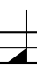
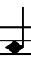
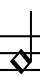
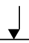
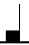
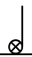
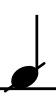
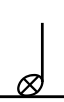
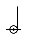
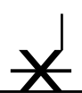

# Dorico configuration to work with Komplete - Abbey Road Modern Drummer

## Overview

Dorico 3.5 mappings for Komplete Abbey Road Modern Drummer

The template contains two mappings, one for white kit and one for sparkle kit. Depending on what kit you use, you need to select the right mapping.

Instruments which are in one but not the other kit play wrong (although they are not mapped, they are not silent).

## Installation

You should be able to open sample project as a template (delete all the flows but keep the player). 

You can manually install percussion kit and percussion map, as follows:

1. In Dorico setup, create a new player and click "Import Kit" and import percussion-kit-white.doricolib or percussion-kit-sparkle.doricolib
2. Go to Play->Playback template,  import and apply plaback-template.dorico_pt
3. This will create Kontakt VST instrument with Sparkle kit at channel 1 and White kit at channel 2, with the appropriate mappings applied. Just make sure your kit is using the right channe

## Example project

See sample-project.dorico

## Mapping

| Drum       | Articulation           | MIDI Note - Spark | MIDI Note - White | Vintage Drummer Ebony | Midi Note Studio Stadium | Dorico  Instrument | Dorico playing technique | Dorico notehea | Dorico example |
| ------------- |-------------| -----| ---- | --- | ------------- | ------------- | ------------- | ------------- | ------------- |
| Kick Drum | Dampened | 36 | % | 60/82 | % | Kick Drum (Low) | Natural |  |  |
|  | Half Open | 82| % | NA |  | |  |  |  |
|  | Open | 82| % | 36 |  | |  |  |  |
| Snare | Center Right/Left Alternating | 38 | % | % | % | Snare Drum | Natural|  |  |
|  | Halfway Right/Left Alternating |  |  | 40 |  | Snare Drum | Edge (drums) |  |  |
|  | Rimshot | 39 | % | % | % | Snare Drum | Rim shot |  |  |
| | Sidestick | 37 | % | % | % | Snare Drum | Cross stick|  |  |
|  | Rim only | 61 | % | % | % | Snare Drum | Rim only|  |  |
| | Roll | 63 | % | % | % |  | |  |  |
| | Flam | 62 | % | % | % |  | |  |  |
| | Brush Tap Left Hand |  |  | 81 |  |  | Brush Tap L |  |  |
| | Brush Tap Right Hand |  |  | 83 |  |  | Brush Tap R |  |  |
| | Brush Dig In |  |  | 84 |  |  | Brush Tip |  |  |
| | Brush Swish |  |  | 86 |  |  | Brush Sweep |  |  |
| Hi-Hat | Closed Tight Tip Right/Left Alternating | 66 | % | % | % | Hi-hat | Closed tight |  |  |
| | Closed Shank Right/Left Alternating | 68 | % | % | % | Hi-hat | Natural |  |  |
| | Closed Tip Right/Left Alternating | 42 | % | % | % | Hi-hat | Tip |  |  |
| | Open Quarter | 76 | % | % | % | Hi-hat | Open Quarter |  |  |
| | Open Half | 77 | % | % | % | Hi-hat | Half-open |  |  |
| | Open Three-Quarters | 78 | % | % | % | Hi-hat | Open 3 Quarters |  |  |
| | Open Loose | 79 | % | % | % | Hi-hat | Open Loose |  |  |
| | Open Full | 80 | % | % | % | Hi-hat | Open 2 |  |  |
| | Closed Pedal | 44 | % | % | % | Hi-hat (pedal) | Natural |  |  |
| | Open Pedal | 70 | % | 70 | % | Hi-hat (pedal) | Open 2 |  |  |
| | Brush Closed Bell |  |  | 85 |  |  | Brush Sweep |  |  |
| | Brush Closed Tip |  |  | 87 |  |  | Brush Tip |  |  |
| | Brush Open |  |  | 90 |  |  | Brush |  |  |
| Tom 1 | Center Right/Left Alternating | 47 | % | 45 | % | Tom (High) | Natural |  |  |
|  | Rimshot | 71 | % | 69 | % | Tom (High) | Rim Shot |  |  |
|  | Rim Only| 75 | % | 73 | % | Tom (High) | Rim Only |  |  |
| | Brush Tap |  |  | 91 |  |  |  |  |  |
| | Brush Dig |  |  | 93 |  |  |  |  |  |
| Tom 2 | Center Right/Left Alternating | 45 | % | 41 | % | Tom (Medium-high) | Natural |  |  |
|  | Rimshot | 69 | % | 65 | % | Tom (Medium-high) | Rim Shot |  |  |
|  | Rim Only | 74 | % | 72 | % | Tom (Medium-high) | Rim Only |  |  |
| | Brush Tap |  |  | 88 |  |  |  |  |  |
| | Brush Dig |  |  | 89 |  |  |  |  |  |
| Tom 3 | Center Right/Left Alternating | 43 | % |  | % | Tom (Medium-low) | Natural |  |  |
|  | Rimshot | 67 | % |  | % | Tom (Medium-low) | Rim Shot |  |  |
|  | Rim Only| 73 | % |  | % | Tom (Medium-low) | Rim Only |  |  |
| Tom 4 | Center Right/Left Alternating | 41 | % |  | % | Tom (Low) | Natural |  |  |
|  | Rimshot | 65 | % |  | % | Tom (Low) | Rim Shot |  |  |
|  | Rim Only| 72 | % |  | % | Tom (Low) | Rim Only |  |  |
| Cymbal 1 (High Crash) | Edge | 49 | % | % | % | Crash Cymbal (High) | Natural |  |  |
|  | Bell | 50 | % | % | % | Crash Cymbal (High) | Bell |  |  |
|  | Tip                                     | 48        | %       | %   | %      | Crash Cymbal (High) | Tip                      |  |  |
|  | Choke | 22 | % | % | % | Crash Cymbal (High) | Choke |  |  |
| | Brush |  |  | 92 |  |  |  |  |  |
| Cymbal 2 (Low Crash) | Edge | 55 | % | % | % | Crash Cymbal (Low) | Natural |  |  |
|  | Bell | 56 | % | % | % | Crash Cymbal (Low) | Bell |  |  |
|  | Tip                                     | 54        | %       | %     | %      | Crash Cymbal (Low) | Tip                      |  |  |
|  | Choke | 24 | % | % | % | Crash Cymbal (Low) | Choke |  |  |
| | Brush |  |  | 94 |  |  |  |  |  |
| Cymbal 3 (Ride) | Tip | 51 | % | % | % | Ride Cymbal | Natural |  |  |
|  | Bell | 53 | % | % | % | Ride Cymbal | Bell |  |  |
|  | Edge | 52 | % | % | % | Ride Cymbal | Crush |  |  |
|  | Choke | 23 | % | % | % | Ride Cymbal | Choke |  |  |
| | Brush Tip |  |  | 95 |  |  |  |  |  |
| | Brush Sweep |  |  | 96 |  |  |  |  |  |
| Cymbal 4 (China) | Edge | 57 | % |  | % | China Cymbal | Natural |  |  |
|  | Tip                                     | 58        | %       |       | %      | China Cymbal | Tip                      |  |  |
|  | Choke | 25 | % |  | % | China Cymbal | Choke |  |  |
| Cymbal 5 (Splash) | Edge | 59 | % |  | % | Splash Cymbal | Natural |  |  |
|  | Choke | 26 | % |  | % | Splash Cymbal | Choke |  |  |
| Perc 1 (Stick) | Hit | 35 | % | % | % | Claves | Natural |  |  |
| Perc 2 (Clap) | Solo | 33 | % | % | % | Hand Claps | Natural |  |  |
| | Multi | 34 | % | % | % | Hand Claps | Chorus |  |  |
| Perc 3 (Cowbell) High | Open | 19 | 29 | 28 | NA | Cowbell (High) | Natural |  |  |
|  | Muted | 21 | 30 | 29 |  | Cowbell (High) | Muted |  |  |
| Perc 3 (Cowbell) LOW | Open | 16 | 27 |  | 27 | Cowbell (Low) | Natural |  |  |
|  | Muted | 17 | 28 |  | 28 | Cowbell (Low) | Muted |  |  |
| | Open Double |  |  |  | 29 |  |  |  |  |
| Perc 3 (Chopper) | High | 29 | 21 |  | NA | Sizzle Cymbal | Up |  |  |
|  | Mid | 28 | 19 |  | NA | Sizzle Cymbal | Natural |  |  |
|  | Low| 27 | 17 |  | NA | Sizzle Cymbal | Down |  |  |
| Tambourine | Tap | 31 | NA | 31 | 31 | Tambourine | Natural |  |  |
| | Shake | 32 | NA | 32 | 32 | Tambourine | Shake |  |  |
| Spiral | Stick | NA | 31 |  | NA | Suspended Cymbal | Natural |  |  |
| | Mallet | NA | 32 |  | NA | Suspended Cymbal | Shake |  |  |
| Sand Paper | Scratch |  |  | 26 |  |  |  |  |  |

