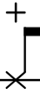
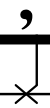
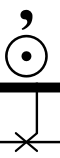
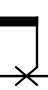

# Dorico configuration to work with Komplete - Abbey Road Modern Drummer

## Installation

1. In Dorico setup, create a new player and click "Import Kit" and import percussion-kit.doricolib

2. In Play menu, go to play->Percussion maps and import percussion-map.doricolib

3. Create Kontakt VST player, load your instruments

4. Map player instruments to kontakt, picking the right channel

5. Click settings next to Kontakt VST and select "Komplete - Abbey Road Modern Drummer" map

## Example project

See sample-project.dorico

## Mapping

| Drum       | Articulation           | MIDI Note  | Dorico playing technique | Dorico example |
| ------------- |-------------| -----| ---- | --- |
| Kick Drum | Dampened | 36 | Natural |  |
|  | Half Open | 82|  | |
|  | Open | 82|  | |
| Snare | Center Right/Left Alternating | 38 | Natural|  |
|  | Rimshot | 39 | Rim shot |  |
| | Sidestick | 37 | Cross stick|  |
|  | Rim only | 61 | Rim only|  |
| Hi-Hat | Closed Tight Tip Right/Left Alternating | 66 | Closed|  |
| | Closed Tip Right/Left Alternating | 42 | Choke|  |
| | Closed Shank Right/Left Alternating | 68 | Centre + Choke|  |
| | Open Quarter | 76 | Natural |  |
| | Open Half | 77 | Half-open |  |
| | Open Three-Quarters | 78 |  |  |
| | Open Loose | 79 |  |  |
| | Open Full | 80 | Open 2 |  |
| | Closed Pedal | 44 |  |  |
| | Open Pedal | 70 |  |  |

