# Dorico configuration to work with Komplete - Abbey Road Modern Drummer

## Installation

1. In Dorico setup, create a new player and click "Import Kit" and import percussion-kit.doricolib

2. In Play menu, go to play->Percussion maps and import percussion-map.doricolib

3. Create Kontakt VST player, load your instruments

4. Map player instruments to kontakt, picking the right channel

5. Click settings next to Kontakt VST and select "Komplete - Abbey Road Modern Drummer" map

## Example project

See sample-project.dorico

## Mapping

| Drum       | Articulation           | MIDI Note  | Dorico playing technique | Dorico example |
| ------------- |-------------| -----| ---- | --- |
| Kick Drum | Dampened | 36 | Natural |  |
|  | Half Open | 82|  | |
|  | Open | 82|  | |
| Snare | Center Right/Left Alternating | 38 | Natural|  |
|  | Rimshot | 39 | Rim shot |  |
| | Sidestick | 37 | Cross stick| 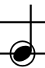 |
|  | Rim only | 61 | Rim only|  |
| Hi-Hat | Closed Tight Tip Right/Left Alternating | 66 | Closed tight | 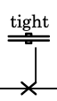 |
| | Closed Shank Right/Left Alternating | 68 | Natural |  |
| | Closed Tip Right/Left Alternating | 42 | Tip | 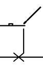 |
| | Open Quarter | 76 | Open Quarter | 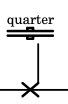 |
| | Open Half | 77 | Half-open | 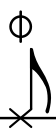 |
| | Open Three-Quarters | 78 | Open 3 Quarters | 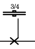 |
| | Open Loose | 79 | Open Loose | 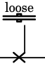 |
| | Open Full | 80 | Open 2 | 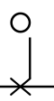 |
| | Closed Pedal | 44 | Natural | 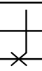 |
| | Open Pedal | 70 | Open 2 | 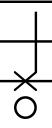 |
| Tom 1 | Center Right/Left Alternating | 47 | Natural |  |
|  | Rimshot | 71 | Rim Shot |  |
|  | Rim Only| 75 | Rim Only | 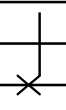 |
| Tom 2 | Center Right/Left Alternating | 45 | Natural |  |
|  | Rimshot | 69 | Rim Shot |  |
|  | Rim Only | 74 | Rim Only |  |
| Tom 3 | Center Right/Left Alternating | 43 | Natural |  |
|  | Rimshot | 67 | Rim Shot |  |
|  | Rim Only| 73 | Rim Only |  |
| Tom 4 | Center Right/Left Alternating | 41 | Natural |  |
|  | Rimshot | 65 | Rim Shot |  |
|  | Rim Only| 72 | Rim Only |  |
| Cymbal 1 (High Crash) | Tip | 48 | Natural | 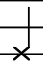 |
|  | Bell | 50 | Center | 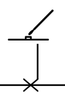 |
|  | Edge | 49 | Crush | 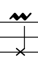 |
|  | Choke | 22 | Choke | 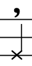 |
| Cymbal 2 (Low Crash) | Tip | 54 | Natural |  |
|  | Bell | 56 | Center |  |
|  | Edge | 55 | Crush |  |
|  | Choke | 24 | Choke |  |
| Cymbal 3 (Ride) | Tip | 51 | Natural |  |
|  | Bell | 53 | Center |  |
|  | Edge | 52 | Crush |  |
|  | Choke | 23 | Choke |  |
| Cymbal 4 (China) | Tip | 58 | Natural |  |
|  | Edge | 57 | Crush |  |
|  | Choke | 25 | Choke |  |
| Cymbal 5 (Splash) | Edge | 59 | Natural |  |
|  | Choke | 26 | Choke |  |
| Perc 1 (Stick) | Hit | 35 | Natural |  |
| Perc 2 (Clap) | Solo | 33 | Natural |  |
| Perc 3 (Cowbell) High | Open | 29 | Natural |  |
|  | Muted | 30 |  |  |
| Perc 3 (Cowbell) LOW | Open | 27 | Natural |  |
|  | Muted | 28 |  |  |
| Perc 3 (Chopper) | High | 21 |  |  |
|  | Mid | 19|  |  |
| Spiral | Stick | 31 |  |  |
| | Mallet | 32 |  |  |

